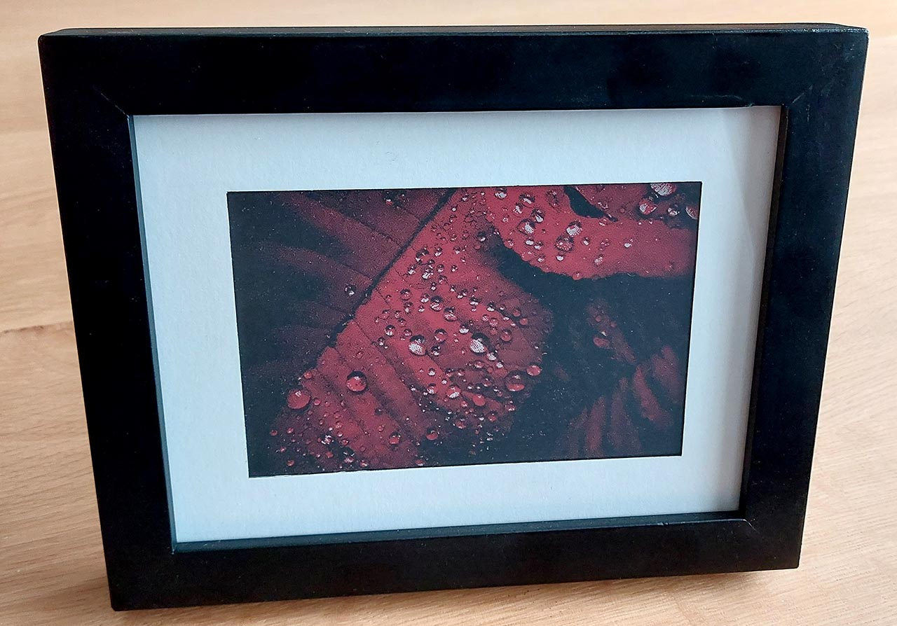
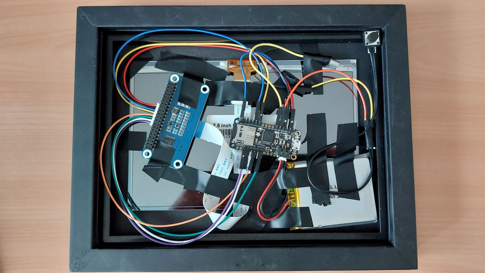

# E-ink picture frame

## Hardware

* A Waveshare 7.5 inch 640x384 pixel tri-color E-Ink display with HAT: https://www.waveshare.com/7.5inch-e-Paper-HAT-C.htm. I used a version with red and black that might still be available, but it can be substituted with the yellow and black version directly. Displays with a different size, resolution or color count will also work, but the code, status images and image conversion script will need adjusting.
* An Adafruit Feather M0 Adalogger board: https://www.adafruit.com/product/2796. This conveniently includes a MicroSD card slot and a two pin LiPoly battery connection that the board can also charge.
* A 3.7V Lithium polymer battery of any decent capacity: https://www.adafruit.com/product/2011. Battery life so far seems to be at minimum a few months with a 2500 mAh battery, most likely more. Still testing it...
* A low capacity MicroSD card for storing pictures. The converted images are 120 Kb a piece, so a cheap tiny MicroSD card will work just fine.
* A tilt sensor for detecting orientation of the picture frame: https://www.adafruit.com/product/173
* A picture frame with enough room inside the frame to mount all of the components.
* A simple button and some wires to connect it all together.

## Preparing images

1. Install Python 3 and the Pillow library (run `pip install pillow` after installing Python).
2. Place either 640x384 images in the `/pictures/landscap` or 384x640 images in the `/pictures/portrait` directories. They need to be paletted images using only 3 colors. There are `.ACT` palettes available in the `/pictures` directory to use with Photoshop color downsampling.
3. Run `convert_images.py` to convert all the PNG files inside `/pictures` directory into images suitable for loading into the display. These will be placed in `/sd`. The images in `/pictures/status` will be converted into C code to be compiled directly into the program. These are required to indicate a low battery status or SD card failure status.

## Build

1. Use the documentation provided by Waveshare to hook up the display to the M0 board: https://www.waveshare.com/wiki/7.5inch_e-Paper_HAT_(C)
2. Connect a button to `A0`. Connect the tilt sensor to `A1`.
4. Copy the contents of `/sd` onto a FAT32 formatted SD card, and insert it into the M0 board.
5. Compile and upload the software using the Arduino IDE. The Adafruit_SleepyDog and SD card library (`SD.h`) are required to be installed.
6. Connect the battery or a USB power source and if all goes well, the display should soon update to a new image.

Here is my **extremely janky** electrical-taped-together setup that shows how all the components are connected. View the image in a separate tab if you want to make out the exact pins that are connected to.

## Usage

The display will refresh roughly 6 hours after first turning on, then roughly every 24 hours. This way you can time the display to refresh at night when nobody is going to notice it, as the refresh cycle takes up to 15 seconds and involves a fair bit of flashing.

Holding down the button for at least 4 seconds will blank the display if the orientation of it has not changed, otherwise it will display a new image in the new orientation. Blanking the display is important to do before disconnecting the power source; the display will "burn in" if an image is left on it for too long.

If the battery is nearly empty (V < 3.6) the display will refresh to show an empty battery image for 6 or 24 hours and then blank the display to prevent it from burning in.

## Code

* The code in `epd7in5b.cpp` is code from Waveshare that has been adapted to be able to send an RLE compressed image directly to the display controller.
* The images in `/pictures/landscap` and `/pictures/portrait` unfortunately have no attribution available as I was not diligent enough to keep track of it. They are however images taken from https://www.pexels.com/ that are free to use even without such attribution. If you are the author of one of the example images and disagree, please contact me.
* The timing relies on the SAMD21 core timing, which is not very accurate over long durations. There will be drift. An actual RTC clock would fix this issue.
